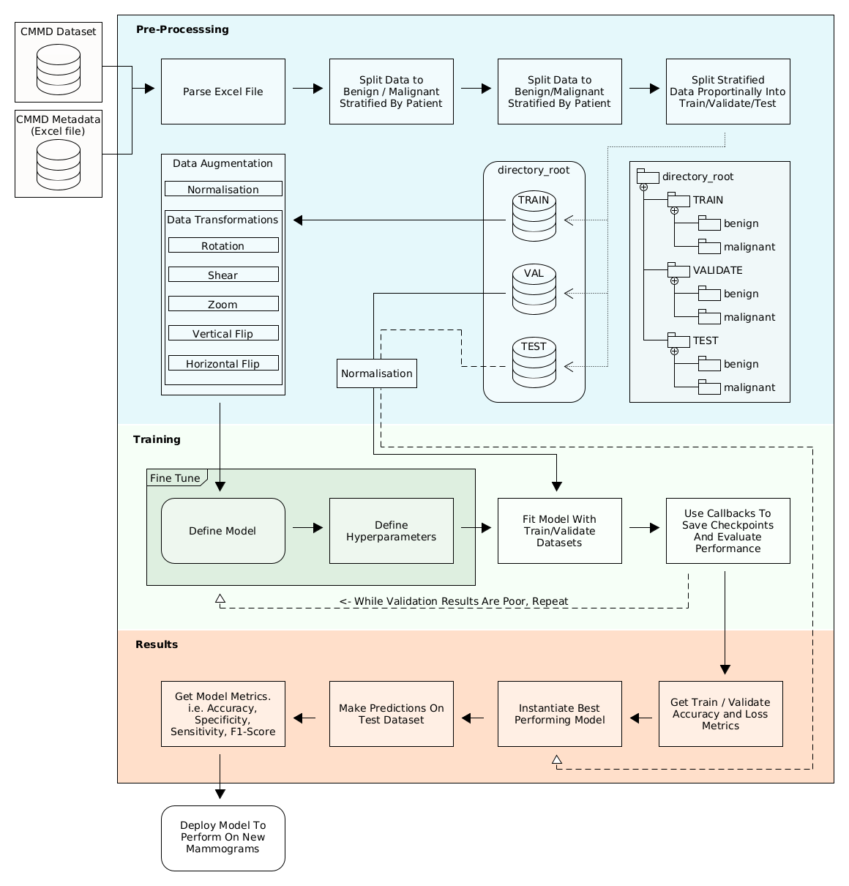

# CMMD Mammography Classification Pipeline


This repository was created as part of my masters degree thesis. 

The Chinese Mammography Database (CMMD) is a recently released mammography dataset which is rich in quality yet has not been researched extensively due to it's very recent release to The Cancer Imaging Archive (TCIA). This repository creates a deep learning pipeline which can be utilised either partially with the CMMD data pre-processing or as a full pipeline in which models can be interchanged or optimised where best suits. It is hoped that the research carried out within my dissertation and within this repository will act as an aid for future resarchers aiming to make use of the CMMD dataset. 

A .pdf version of my dissertation including model results will be uploaded upon recieving marks/feedback on my submission. Until then, please feel free to make the most of this repository. Also please feel free to contact me if you have any questions whatsoever.

Good Luck.

<hline>

## Features

- CMMD Data Exploration
- CMMD Metadata Pre-processing
- Split Data to Bening/Malignat with Stratification by Patient
    - Train
    - Validate
    - Test
- Data Augmentation
- Training
  - Custom Model Definition
    - AlexNet
    - LeNet
  - Transfer Learning
    - ResNet50
    - VGG16
    - Xception
      - Fine Tuning
- Testing
  - Model Evaluation
  - Model Predictions
  - Model Metrics


## Prerequisites

- Python 3.8.10

- CUDA 10.1

Get required Python packages:
```
git clone https://github.com/CraigMyles/cggm-mammography-classification.git
cd cggm-mammography-classification
pip install -r requirements.txt
```

## Get Dataset
The CMMD dataset can be freely downloaded from The Cancer Imaging Archive (TCIA)
You must use the [NBIA Data Retriever](https://wiki.cancerimagingarchive.net/display/NBIA/Downloading+TCIA+Images) to download [The Chinese Mammography Database (CMMD)](https://wiki.cancerimagingarchive.net/pages/viewpage.action?pageId=70230508). 

For download instructions, follow this guide: [Downloading Data from the TCIA Data Portal Using the Data Retriever](https://www.youtube.com/watch?v=NO48XtdHTic).

Download the CMMD ``manifest`` and ``clinicaldata`` file to a folder within your working directory.

E.g.
- /path/to/my/dir/dataset/manifest-1616439774456
- /path/to/my/dir/dataset/CMMD_clinicaldata_revision.xlsx


## Run Instructions

To run the pipeline in its entirety, begin with file ``0_``and run each notebook in sequential order tll ``5_`` . 

If you only require the CMMD preprocessing and metadata handling, please run sections `0_0_Data_Exploration.ipynb`,  ``0_Data_Exploration.ipynb``, and ``1_stratification_data_split.ipynb``


## Classification Pipeline



<hline>
    
## Contact 
* Craig Myles (me@craig.im)
